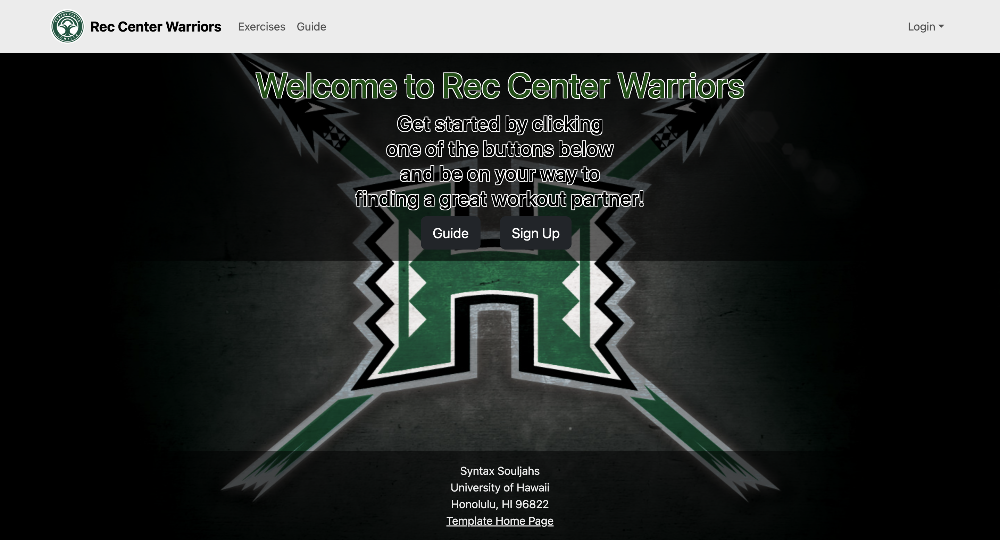
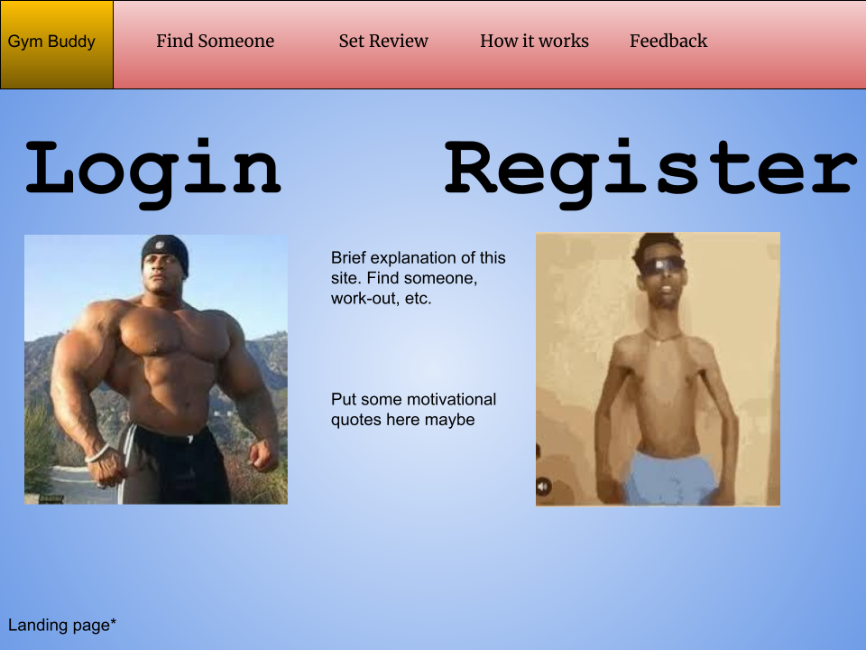

# Gym Buddy

## Table of contents

* [Overview](#overview)
* [Deployment](#deployment)
* [User Guide](#user-guide)
* [Community Feedback](#community-feedback)
* [Developer Guide](#developer-guide)
* [Development History](#development-history)
* [Walkthrough videos](#walkthrough-videos)
* [Example enhancements](#example-enhancements)
* [Team](#team)

## Overview


Gym Buddy is a specialized social networking platform for UH Manoa tailored for both seasoned gym enthusiasts and individuals aspiring to embark on their fitness journey within the school community. It serves as a platform for students and staff with similar goals in the gym to work out with eachother, motivate each other, and share their fitness journeys. Gym Buddy allows users to create profiles, connect with friends, join groups, post updates, and engage in discussions related to fitness and wellness.

## Deployment

[Our Deployed Application](https://rcwarriors.fit/)

Gym Buddy will initially be deployed as a web application accessible through any modern web browser. It will feature responsive design to ensure compatibility across various devices including desktops, laptops, tablets, and smartphones. Additionally, native mobile applications for iOS and Android may be considered for future development based on user demand and feedback


## User Guide

As you visit our page for the first time  you'll be welcomed by our vibrant landing page, offering you a variety of options to ensure an enjoyable experience during your stay



If this is your first visit, you have two options: take a quick tour with our guide to get a feel for what we offer, or dive right in and create a new account. The choice is yours

guide page:


register page:


However if you're a returning user you can login with your email address and password


once you login there will be three sections for you to choose the find a buddy page, the exercises page, and the workout schedule page

find a buddy:


exercises:


workout schedule customization:


However if you are an admin, you have access to all the profiles made so far


and once you are fulfilled with your rc warriors experience you can click your profile on the top right corner and click sign out on the drop down


whether you're a seasoned powerlifter, dedicated bodybuilder, enthusiastic crossfit athlete, or a newcomer eager to kickstart your gym journey. By categorizing yourself, Gym Buddy facilitates connections with like-minded individuals sharing similar fitness aspirations or simply keen on exploring diverse interests. Once your profile is set up, dive into the community to discover fellow gym enthusiasts pursuing similar goals or simply immerse yourself in the vibrant atmosphere of the gym environment.

## Community feedback

Feedback from the Gym Buddy community will be actively solicited and valued to drive ongoing improvements and enhancements. Regular surveys, feedback forms, and user forums will be utilized to gather input on desired features, usability issues, and overall user satisfaction.

## Developer Guide

### Installation

First, [install Meteor](https://www.meteor.com/install).

Second, visit the [gym buddies application page](https://github.com/Syntax-Souljahs/SyntaxSouljahs.github.io), and click the "Use this template" button to create your own repository initialized with a copy of this application. Alternatively, you can download the sources as a zip file or make a fork of the repo.  However you do it, download a copy of the repo to your local computer.

Third, cd into the gymbuddy/app directory and install libraries with:

```
$ meteor npm install
```

Fourth, run the system with:

```
$ meteor npm run start
```

If all goes well, the application will appear at [http://localhost:3000](http://localhost:3000).

## Development History


[Our Team Contract](https://github.com/Syntax-Souljahs/Syntax-Souljahs.github.io/tree/main/Contracts)

[Our Github organization](https://github.com/Syntax-Souljahs)

[Our M1 project page](https://github.com/orgs/Syntax-Souljahs/projects/1)

[Our M2 project page](https://github.com/orgs/Syntax-Souljahs/projects/3)

The Development History section will provide an overview of the creators, milestones, iterations, and updates that have shaped the evolution of Gym Buddy from its inception to its current state. It will highlight key features, enhancements, and challenges encountered throughout the development process.


## Walkthrough Videos
Walkthrough videos will be created to provide visual demonstrations of Gym Buddy's features and functionalities. These videos will serve as helpful resources for new users seeking guidance on how to navigate the platform and utilize its various tools effectively.

## Example Enhancements
Example Enhancements will outline potential future features and improvements that could be implemented in Gym Buddy based on user feedback and emerging trends in the fitness and social networking industries. These enhancements will be prioritized and incorporated into the development roadmap as appropriate.

## Team
Comprising six passionate individuals from a software engineering class (Tyler Mak, Isai Foglesong, Alvin Wu, Shane Baclig, Ronan Russel Andal, and Hunter Von Tungeln) the Gym Buddy development team shares an equal devotion to fostering a thriving gym community.
