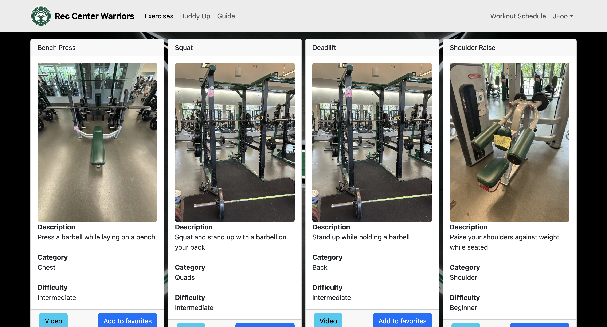

# Rec Center Warriors

## Table of contents

* [Overview](#overview)
* [Deployment](#deployment)
* [User Guide](#user-guide)
* [Community Feedback](#community-feedback)
* [Developer Guide](#developer-guide)
* [Development History](#development-history)
* [Team](#team)

## Overview


Rec Center Warriors is a specialized social networking platform for UH Manoa tailored for both seasoned gym enthusiasts and individuals aspiring to embark on their fitness journey within the school community. It serves as a platform for students and staff with similar goals in the gym to work out with eachother, motivate each other, and share their fitness journeys. Gym Buddy allows users to create profiles, connect with friends, join groups, post updates, and engage in discussions related to fitness and wellness.

For many individuals, starting a fitness journey can be frightening, particularly when faced with the intimidating atmosphere of a gym. Rec Center Warriors addresses this challenge by offering a supportive network where users can find companionship, encouragement, and guidance from like-minded peers. Whether seeking a workout partner or simply looking to engage with others on their fitness path, Rec Center Warriors fosters a welcoming environment where members can thrive together.


## Deployment

[Our Deployed Application](https://rcwarriors.fit/)

Gym Buddy will initially be deployed as a web application accessible through any modern web browser. It will feature responsive design to ensure compatibility across various devices including desktops, laptops, tablets, and smartphones. Additionally, native mobile applications for iOS and Android may be considered for future development based on user demand and feedback


## User Guide

As you visit our page for the first time  you'll be welcomed by our vibrant landing page, offering you a variety of options to ensure an enjoyable experience during your stay


If this is your first visit, you have two options: take a quick tour with our guide to get a feel for what we offer, or dive right in and create a new account. The choice is yours

guide page:


register page:


However if you're a returning user you can login with your email address and password


once you login you are greeted by a welcoming home screen with a bunch of pages you can visit


The exercises page offers a variety of workouts for your next exercise session, complete with instructional videos for those unfamiliar with proper execution.



You also have the option to put some exercises into your favorites which can be accessed in the favorite exercises page on the dropdown section of your username on the top right


the Buddy Up page where you can match with people with similar training goals as you


You can check the guide again if you needed to see the instructions a second time


Workout schedule customization:


You can also check your profile to see your statistics


You also have the option to change your info to your liking with the edit button


However if you are an admin, you have access to all the profiles made so far


and once you are fulfilled with your Rec Center Warriors experience you can click your profile on the top right corner and click sign out on the drop down


whether you're a seasoned powerlifter, dedicated bodybuilder, enthusiastic crossfit athlete, or a newcomer eager to kickstart your gym journey. By categorizing yourself, Gym Buddy facilitates connections with like-minded individuals sharing similar fitness aspirations or simply keen on exploring diverse interests. Once your profile is set up, dive into the community to discover fellow gym enthusiasts pursuing similar goals or simply immerse yourself in the vibrant atmosphere of the gym environment.

## Community feedback

<p>From our community feedback, it's clear that there's excitement and interest in our application. Users appreciate the interactive and professional homepage, likening it to a Facebook for the gym. However, there are consistent concerns about the mobile interface, including text overlap and font readability issues. Suggestions for improvement include indicating a desktop preference, adding more detailed user information, fixing video functionality, and enhancing social features like workout schedule sharing and adding a friends list. Despite these issues, users recognize the app's potential and commend its simplicity and professional design.</p>

Here is the raw feedback from individuals in the community who have accessed the app

"Very interactive homepage, looks very professional, the app has a lot of potential, I can see me and my friends use it a bunch to interact with people. Maybe fix up the interface on an Iphone but other than that it looks like the app could be a big hit. Almost like a facebook but for the gym"- Kimberly Ogata

<p></p>

<p>" 
I really liked the concept for your webpage. A match maker for lifting is a great idea, that I think would get a lot of use.  While the desktop layout is straightforward, the mobile view needs improvement, with text overlapping and awkward box sizes. Font readability varies, particularly harsh on title/welcome pages. It's suggested to indicate a desktop preference. Enhancing social features like sharing workout schedules and adding a friends list could improve user engagement. Consider future expansions like a streak system. Overall, there's evident potential for business development." - Ashton Ka'ahanui-Isaacson</p>

<p>
"Yeah I just went on! It seems easy to use and the concept is something I bet lots of students are interested in. Maybe being able to put down some more information about the advance level the person is in. Possibly putting down their max weights they use. The videos don't work, but the idea of having tutorials on how to do certain workouts is very helpful. Really good concept and hope more is added to it." - Sonse Kawasaki</p>

<p>"I like how it is simple to set up and when you get into it and start using it the interface is not busy or all over the place. I also like the exercises tab, also on phone the fonts are too small and everything is too close together, but on the laptop it's all good" - Paul Pladera</p>

<p>"The design is pretty professional, almost like it is straight out of UH Manoa, but functionality wise it has a lot to improve on, which makes sense because it is still a work in progress. Phone version is completely different that PC also, but other than that has a lot of potential. Otherwise all the basic functions work great and to a non coders POV the app looks great" - Earl Ramos</p>


## Developer Guide

### Installation

First, [install Meteor](https://www.meteor.com/install).

Second, visit the [gym buddies application page](https://github.com/Syntax-Souljahs/RecCenterWarriors), and click the "Use this template" button to create your own repository initialized with a copy of this application. Alternatively, you can download the sources as a zip file or make a fork of the repo.  However you do it, download a copy of the repo to your local computer.

Third, cd into the gymbuddy/app directory and install libraries with:

```
$ meteor npm install
```

Fourth, run the system with:

```
$ meteor npm run start
```

If all goes well, the application will appear at [http://localhost:3000](http://localhost:3000).

## Development History


[Our Team Contract](https://github.com/Syntax-Souljahs/Syntax-Souljahs.github.io/tree/main/Contracts)

[Our Github organization](https://github.com/Syntax-Souljahs)

[Our M1 project page](https://github.com/orgs/Syntax-Souljahs/projects/1)

[Our M2 project page](https://github.com/orgs/Syntax-Souljahs/projects/3)

[Our M3 project page](https://github.com/orgs/Syntax-Souljahs/projects/4)

The Development History section will provide an overview of the creators, milestones, iterations, and updates that have shaped the evolution of Gym Buddy from its inception to its current state. It will highlight key features, enhancements, and challenges encountered throughout the development process.


## Team
Comprising six passionate individuals from a software engineering class (Tyler Mak, Isai Foglesong, Alvin Wu, Shane Baclig, Ronan Russel Andal, and Hunter Von Tungeln) the Gym Buddy development team shares an equal devotion to fostering a thriving gym community.
